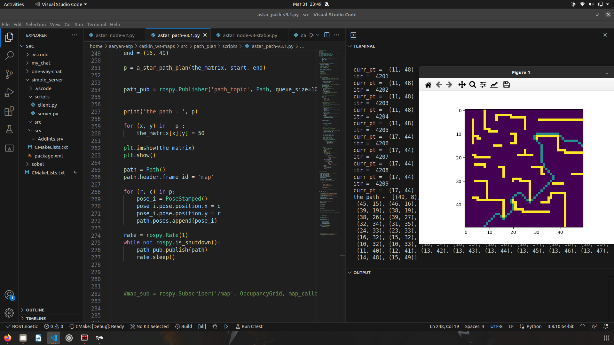
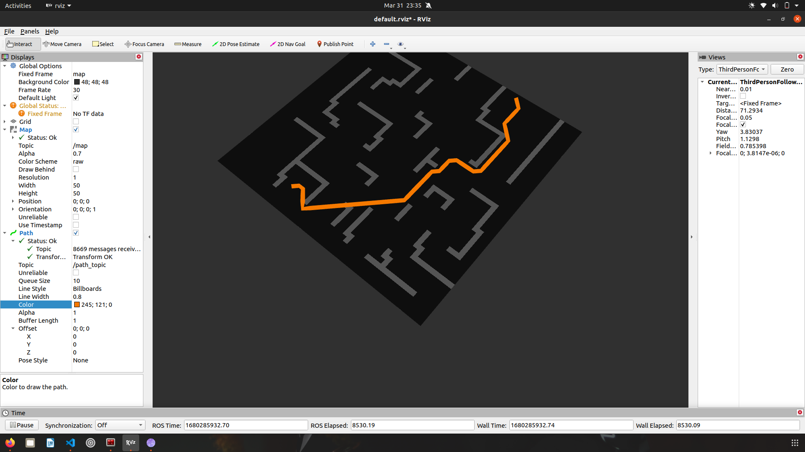
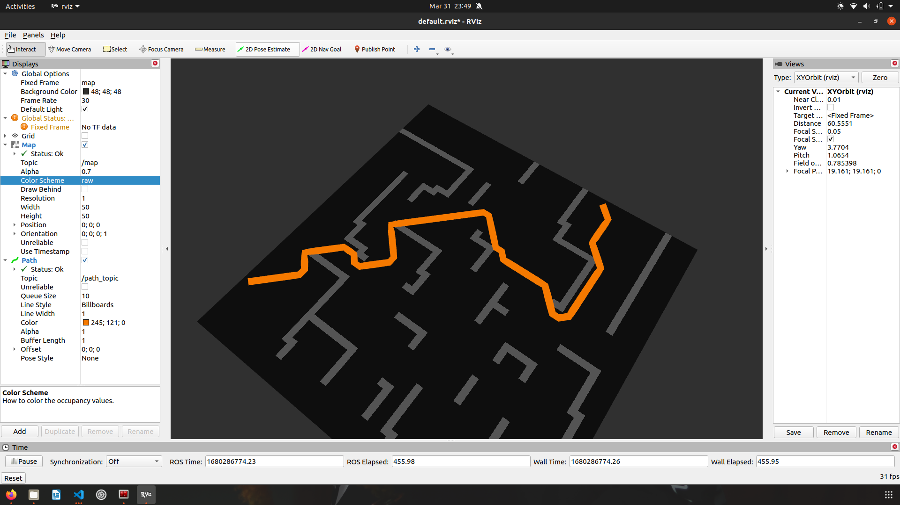

Hello!

This is my implementation of the a-star path planning algorithm.
The maps are stored in the 'maps' folder inside the src. 
The map server can be initiated with the 'map_maze.yaml' file.

When you run the main program (astar_path-v3.1), first a matplotlib representation of the path is shown. The node publishes the path as soon as soon as the matplotlib window is closed.

Then the path can be visualized in rviz using the /path_topic and /map topics.

You can also set different start and end coordinates in the main program.

(Thank You :)

## Example Outputs

## Path published and vishualized in Rviz

